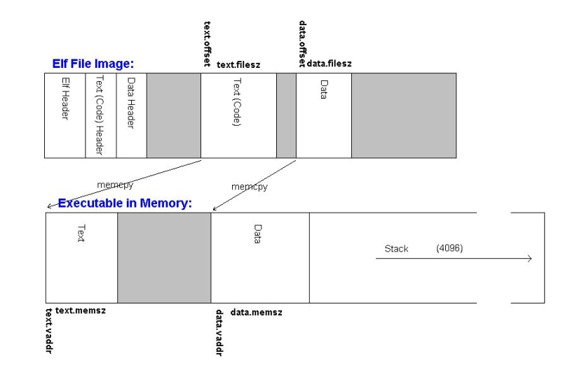
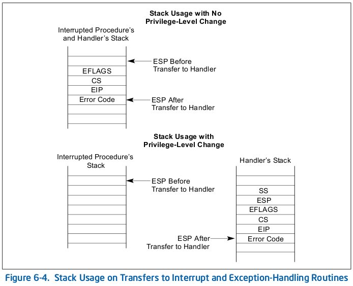

Proyecto 2: procesos de usuario
===============================

---

Resumen:
========

* Motivación.
* Por arriba.
* Que hay que completar.
* Como seguimos (entrega intermedia, 2 clases más).
* Material de Lectura.

---

Motivación: ¿Qué necesito para tener procesos de usuario?
=============================================

---

Necesito
--------

* **Protección** (kernel vs. user).
* Definir un **layout** para la memoria de usuario y poner allí los pedazos del ELF.
* Aumentar los `kthread` con **información de procesos de usuarios**.
* Definir la interface de inicio y fin del proceso con el kernel: **`int main(argc,argv)`**.
* **Lanzar** el proceso.
* **Cambiar el mapa de memoria** cuando cambia el ctxt a un proceso de usuario.
* Definir la interface de comunicación del proceso con el kernel: **syscalls**.

---

Por arriba
==========

---

Protección
==========

* Estamos en modo protegido, luego hay segmentación.
* Diferenciar **Logical** address vs. **Linear** address.
    * process vs. kernel memory.
* Definir una `LDT` con los segmentos básicos para correr el proceso usuario.
    * Segmento de **datos**, segmento de **código**.

---

Layout de memoria
=================

Hay que usar el ELF y `argc, argv` para definir el layout

* Definir tamaño de la imagen del proceso.
* Copiar los segmentos ELF.
* Copiar `argc,argv` en algún lugar de la memoria.
* Dejar espacio para el stack.
* ¿Y el heap? ¿Cuánta memoria dejamos para alocación dinámica -- `brk()`?

---

Layout de memoria (2)
=====================

Le faltaría la **lista de argumentos**.

---

Contexto de Usuario
===================

El hilo de kernel que manejará el proceso de usuario tiene información extra.

* Memory layout.
    * LDT
    * Selectores
* Tamaño de la imagen ejecutable.
* Punto de entrada.
* Donde está el stack.
* Ubicación de `argc, argv`.

---

Lanzar el proceso
=================

Dejar todo como si lo hubieran interrumpido en el punto de entrada.

Encolarlo en *runnable*.

---

Cambiar de contexto
===================

Cambiar entre los memory layout de cada proceso, o sea la segmentación.

Toquetear un poco el stack del kernel.

---

Que hay que completar
=====================

---

Varios `TODO()`
===============

Hay más, pero para esta *primera parte* solo estos.

`kthread.c`
-----------
    !c
    void Setup_User_Thread(
        struct Kernel_Thread* kthread, struct User_Context* userContext) {
        TODO("Create a new thread to execute in user mode");
    }

    struct Kernel_Thread*
        Start_User_Thread(struct User_Context* userContext, bool detached) {
        TODO("Start user thread");
    }

`user.c`
--------

    !c
    int Spawn(const char *program, const char *command, struct Kernel_Thread **pThread)
    {
        TODO("Spawn a process by reading an executable from a filesystem");
    }

    void Switch_To_User_Context(struct Kernel_Thread* kthread, struct Interrupt_State* state)
    {
        TODO("Switch to a new user address space, if necessary");
    }

---

Siguen los `TODO()`
===================

`main.c`
--------

    !c
    static void Spawn_Init_Process(void)
    {
        TODO("Spawn the init process");
    }

`userseg.c`
-----------

    !c
    /* TODO: Implement
    static struct User_Context* Create_User_Context(ulong_t size)
    */

    void Destroy_User_Context(struct User_Context* userContext)
    {
        TODO("Destroy a User_Context");
    }

    int Load_User_Program(char *exeFileData, ulong_t exeFileLength,
        struct Exe_Format *exeFormat, const char *command,
        struct User_Context **pUserContext)
    {
        TODO("Load a user executable into a user memory space using segmentation");
    }

    void Switch_To_Address_Space(struct User_Context *userContext)
    {
        TODO("Switch to user address space using segmentation/LDT");
    }

---

Crear un proceso
================

Crea y lanza un proceso de usuario a partir de:

* Un path en el FS que apunta a un ELF.
* Una lista de argumentos.

`Spawn()`:

* `Read_Fully()` : lista
* `Parse_ELF_Executable()` : proyecto 1
* `userseg.c:Load_User_Program()` : **completar**
* `kthread.c:Start_User_Thread()` : **completar**

---

Cargar el programa en memoria
=============================

`userseg.c:Load_User_Program()`

* Establece el tamaño de la imagen que contendrá el proceso.
* **Crea el contexto de usuario dentro del kthread**.
* Copia los segmentos ELF a la memoria.
* Copia los argumentos a la memoria.
* (probablemente) Resetea pedazos de memoria.
* Termina de cargar el contexto de usuario.

---

Argumentos de la línea de comandos
==================================

Crear un `struct Argument_Block` usando:

* `Get_Argument_Block_Size()`
* `Format_Argument_Block()`
* Copiar este cachito de memoria a la imagen en memoria del proceso.

El proceso cuando se lo lanza recibe el puntero al `struct Argument_Block` por `ESI`.

`libc/entry.c`:

    !c
    void _Entry(void)
    {
        struct Argument_Block *argBlock;

        /* The argument block pointer is in the ESI register. */
        __asm__ __volatile__ ("movl %%esi, %0" : "=r" (argBlock));

        /* Call main(), and then exit with whatever value it returns. */
        Exit(main(argBlock->argc, argBlock->argv));
    }

---

Crear contexto de usuario
=========================

Aumentar `struct Kernel_Thread` con el contexto de usuario: `struct User_Context`

Rellenar `{Create,Destroy}_User_Context()`.

En la creación del contexto:

* Crea la memoria del proceso.
* Definir la `LDT` correspondiente:
    * Delicado
    * Entender bien segmentación en ia32.
    * Las [filminas CMSC 412, 2005](http://www.cs.umd.edu/class/spring2005/cmsc412/proj2/proj2.ppt) son muy valiosas.

En la próxima clase vamos a hablar de **Segmentación en ia32**, para que este punto quede más claro.

---

Lanzar el proceso
=================

Hay que llenar `Start_User_Thread()`.

* Crear un hilo de kernel
* Establecer el contexto de usuario (es un argumento).
* Inicializar el stack.
* Marcarla como *runnable*.

La complejidad está en `Setup_User_Thread()`:

* Dejar el stack como si lo hubieran interrumpido.
* Ver `int.h:struct Interrupt_State` para ver cual es el formato que se espera en el stack.
* Poner en cada campo el valor que se espera, ej: en el `EIP` la `struct Exe_Format.entryAddr`.

---

Asi deja el ia32 el stack luego de una interrupción:

---

Cambio de contexto
==================

`user.c:Switch_To_User_Context()`

* Solo actuar si `userContext!=NULL`.
* Cambiar al `LDT` de este proceso de usuario.
* *Move the stack pointer one page*. !?
    * El único punto donde utiliza `TSS`.
    * `tss.c:Set_Kernel_Stack_Pointer()`.
    * Solo utiliza un `TSS`.

La parte importante es donde **cambia la imagen del proceso**

`userseg.c:Switch_To_Address_Space()`:

* `lldt` con el selector de la LDT que le corresponde a ese proceso.
* inline assembler!

---

Consejos
========

* Hasta que no completen todos los `TODO()`, no van a tener **nada** funcionando.
* Hay que agregar pocas líneas (100?), asi que programen de manera muy cuidadosa.
* Debuggear es penoso:
    * Escriban código sencillo.
    * Usen `KASSERT` para todas las condiciones que están suponiendo.
    * De última `Print()` puede ser de utilidad.
* Es muy útil un editor que parsee el código todo el tiempo y pueda saltar a la definición de los símbolos, tenga autocompletar, etc. .

---

Como pruebo
===========

Cambiar `main.c:INIT_PROGRAM` para lanzar `null.exe`.

    !c
    /*
     * A test program for GeekOS user mode
     */

    #include <process.h>

    int main(int argc, char** argv)
    {
      Null();
      for(;;);
      return 0;
    }

Que nunca retorne, porque la syscall `Exit()` no está implementada.

(esta es la última parte de la comunicación entre el kernel y el proceso, el **valor de retorno**)

---

Como pruebo más cosas
=====================

**No** se debería poder desde userspace:

* Comprobar que se pasan bien `argc, argv`.
* Llamar a interrupciones que no sean la `INT90`.
* Ejecutar instrucciones protegidas como `in, outs` a puertos o `lgdt` :) .
* Escribir en el código.
* Irme de los límites en: código, stack y datos.

Estamos testeando que hayamos establecido correctamente la **segmentación** y el **modo protegido**.

---

Como seguimos
===================

---

Planes para las 3 semanas
=========================

* El proyecto se divide en dos partes:
    * Hacer funcionar `/c/null.exe` (2 semanas).
    * Implementar el resto de los syscalls para que funcione `/c/shell.exe` (1 semana).
* Clase 2: **ia32 segmentation**.
* Clase 3: **syscall ifce**.

---

Material de Lectura
===================

---

Imprescindibles
===================

* "*GeekOS Hacking Guide*" (tal vez demasiado breve).
* Proyecto de [CMSC 412](http://www.cs.umd.edu/class/spring2005/cmsc412/proj2/), 2005.
* Las [filminas](http://www.cs.umd.edu/class/spring2005/cmsc412/proj2/proj2.ppt) con más información.
* *Intel® 64 and IA-32 Architectures Software Developer's Manual Volume 3A: System Programming Guide*, [Part 1, Chapter 3](http://www.intel.com/Assets/PDF/manual/253668.pdf).

Recomendados
============

* `proyect1/src/geekos/lprog.c`.
* Tom Shanley, *Protected Mode Software Architecture*, Mindshare, 1996.

