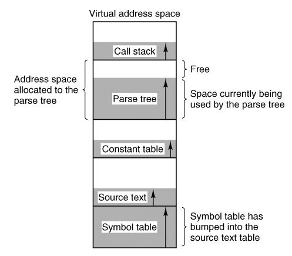
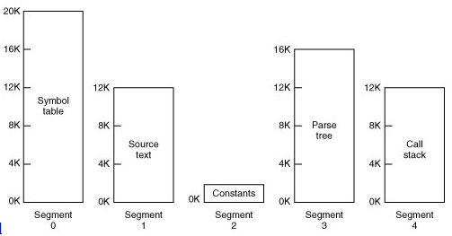
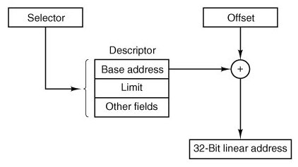
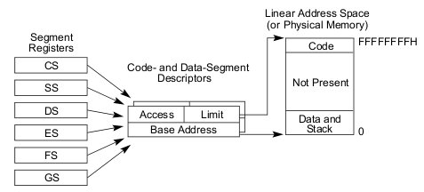
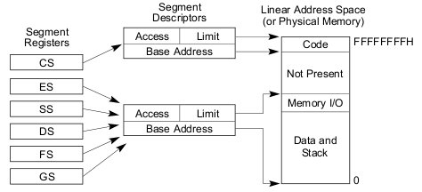
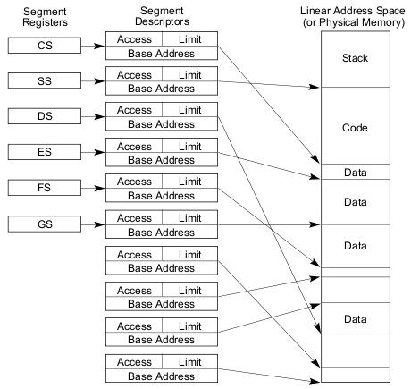
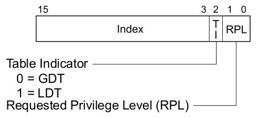
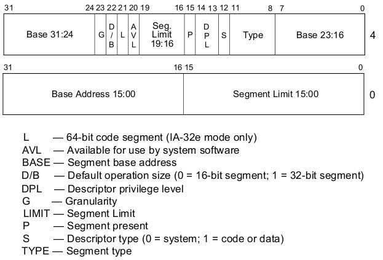
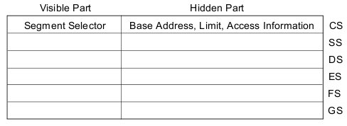

Segmentación en ia32
====================

---

Resumen:
========

* Motivación.
* Segmentación en ia32.
* Material de Lectura.

---

Motivación histórica y desde los libros de texto
================================================

---

¿Para qué segmentación?
=======================

---

Un mundo segmentado
===================

---

Lo básico
=========

Mapeo de direcciones *Logical* -> *Linear*

	!c
	logical2linear(void *logical) {
		if (logical < segment->limit) {
			linear = segment->base + logical;
		} else {
			raise "#GP";
		}
		return linear;
	}

Además de revisar **protección**.

Recordar:

* En cada instruction fetch (segmento de programa).
* En el medio del instruction execute (segmento de datos o de stack).

---

Historia: 8086 (1978)
=====================

Muy buen [artículo](http://en.wikipedia.org/wiki/X86_memory_segmentation) en la Wikipedia.

* Larga vida y prosperidad a los `.com`. (CP/M... paredón y después).
* Problema: registros de 16 bits (64KB), bus de direcciones de 20 bits (1MB).
* `linear = segment<<4 + offset`.
* **Far pointer/call/jump**: `segment:offset`.
* Segmentos implícitos con **registros de segmentos**:
	* `CS`, `DS`, `ES`, `SS`.
	* Código, datos, extra, pila.
* El mapeo logical -> linear **no es inyectivo**.
* **No hay protección**.

---

80286 (1982)
============

* Modo protegido (4 niveles), MMU.
* Direcciones físicas 24 bits (16MB), lógicas de 30 bits (1GB).
* El gap ya no se cubrió con `segment<<4+offset`, usaron **segment selectors**:
	* Idem registros de segmentos para implicit addressing: `CS`, `SS`, `DS`, `ES`.
	* Una tres-upla *(índice, tabla, privilegio)*.
	* Dos tablas:
		* Global Descriptor Table -- [GDT](http://en.wikipedia.org/wiki/Global_Descriptor_Table)
		* Local Descriptor Table -- [LDT](http://en.wikipedia.org/wiki/Local_Descriptor_Table)
* Todo esto es más viejo que la injusticia: [THE](http://en.wikipedia.org/wiki/THE_multiprogramming_system) (1965), [Multics](http://en.wikipedia.org/wiki/Multics) (1964).

¿Recuerdan la [HMA](http://en.wikipedia.org/wiki/High_Memory_Area) de DOS?
(la nostalgia me invade)

---

80386 (1985)
============

* 32 bits addressing.
* Segmentación + **paginación**.
* Más registros de segmentos: `FS`, `GS`.

Esto es **ia32**
----------------

---

Segmentación en ia32
====================

---

Conversión de lógica a lineal
=============================

Veamos diferentes formas de usar la segmentación.

---

Modos de uso de los segmentos (1)
=================================

Plano

Plano con protección

---

Modos de uso de los segmentos (2)
=================================

Multisegmentado

---

Segment Selectors
=================

Como la tripla *(base,limit,others)* es muy grande se utilizan dos tablas de **segment descriptors** (GDT, LDT), 
indexada por **segment selectors**.

---

Segment Descriptors
===================

---

Segment Registers
=================

Adentro de los registros `CS`, `SS`, `DS`, `ES`, `FS`, `GS`.

**Creo** que no hay forma explícita de nombrar un segment descriptor en un operando.

---

Material de Lectura
===================

---

Imprescindibles
===================

* "*GeekOS Hacking Guide*" (tal vez demasiado breve).
* Proyecto de [CMSC 412](http://www.cs.umd.edu/class/spring2005/cmsc412/proj2/), 2005.
* Las [filminas](http://www.cs.umd.edu/class/spring2005/cmsc412/proj2/proj2.ppt) con más información.
* *Intel® 64 and IA-32 Architectures Software Developer's Manual Volume 3A: System Programming Guide*, [Part 1, Chapter 3](http://www.intel.com/Assets/PDF/manual/253668.pdf).

Recomendados
============

* `proyect1/src/geekos/lprog.c`.
* Tom Shanley, *Protected Mode Software Architecture*, Mindshare, 1996.

