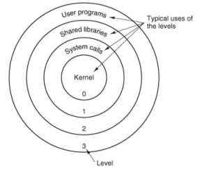
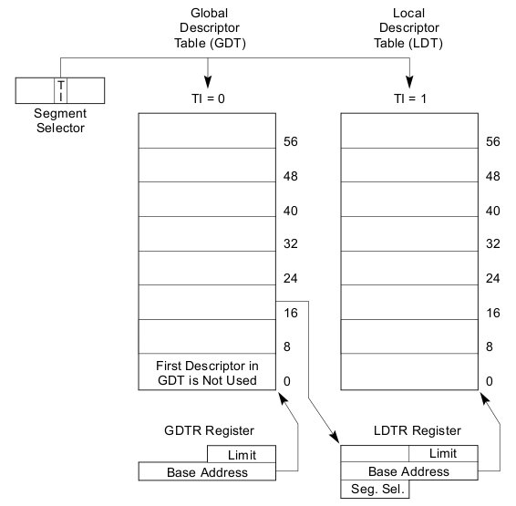

Segmentación en ia32
====================

---

Resumen:
========

* Motivación.
* Segmentación en ia32.
* Material de Lectura.

---

Motivación histórica y desde los libros de texto
================================================

---

¿Para qué segmentación?
=======================

---

Un mundo segmentado
===================

---

Lo básico
=========

Mapeo de direcciones *Logical* -> *Linear*

	!c
	logical2linear(void *logical) {
		if (logical < segment->limit) {
			linear = segment->base + logical;
		} else {
			raise "#GP";
		}
		return linear;
	}

Además de revisar **protección**.

Recordar:

* En cada instruction fetch (segmento de programa).
* En el medio del instruction execute (segmento de datos o de stack).

---

Historia: 8086 (1978)
=====================

Muy buen [artículo](http://en.wikipedia.org/wiki/X86_memory_segmentation) en la Wikipedia.

* Larga vida y prosperidad a los `.com`. (CP/M... paredón y después).
* Problema: registros de 16 bits (64KB), bus de direcciones de 20 bits (1MB).
* `linear = segment<<4 + offset`.
* **Far pointer/call/jump**: `segment:offset`.
* Segmentos implícitos con **registros de segmentos**:
	* `CS`, `DS`, `ES`, `SS`.
	* Código, datos, extra, pila.
* El mapeo logical -> linear **no es inyectivo**.
* **No hay protección**.

---

80286 (1982)
============

* Modo protegido (4 niveles), MMU.
* Direcciones físicas 24 bits (16MB), lógicas de 30 bits (1GB).
* El gap ya no se cubrió con `segment<<4+offset`, usaron **segment selectors**:
	* Idem registros de segmentos para implicit addressing: `CS`, `SS`, `DS`, `ES`.
	* Una tres-upla *(índice, tabla, privilegio)*.
	* Dos tablas:
		* Global Descriptor Table -- [GDT](http://en.wikipedia.org/wiki/Global_Descriptor_Table)
		* Local Descriptor Table -- [LDT](http://en.wikipedia.org/wiki/Local_Descriptor_Table)
* Todo esto es más viejo que la injusticia: [THE](http://en.wikipedia.org/wiki/THE_multiprogramming_system) (1965), [Multics](http://en.wikipedia.org/wiki/Multics) (1964).

¿Recuerdan la [HMA](http://en.wikipedia.org/wiki/High_Memory_Area) de DOS?
(la nostalgia me invade)

---

80386 (1985)
============

* 32 bits addressing.
* Segmentación + **paginación**.
* Más registros de segmentos: `FS`, `GS`.

Esto es **ia32**
----------------

---

Segmentación en ia32
====================

---

Conversión de lógica a lineal
=============================

Veamos diferentes formas de usar la segmentación.

---

Modos de uso de los segmentos (1)
=================================

Plano

Plano con protección

---

Modos de uso de los segmentos (2)
=================================

Multisegmentado

---

Segment Selectors
=================

Como la tupla *(base,limit,accesscontrol)* es muy grande se utilizan dos tablas de **segment descriptors** (GDT, LDT), indexada por **segment selectors**.

Donde el RPL indica uno de los 4 niveles de protección.

---

Segment Descriptors
===================

Un lío de parámetros en 8 bytes tanto para escribir como para *leer*.
Ya los veremos en detalle.

---

Segment Registers
=================

(creo que) No hay forma explícita de nombrar un *segment selector* y menos aún un *segment descriptor* en un operando.

Todo es vía *segment registers* que contienen *segment selectors*.

La idea es reducir el **tiempo de traducción de direcciones**, y la **complejidad de codificación**.

Adentro de los registros `CS`, `SS`, `DS`, `ES`, `FS`, `GS`, se **cachea** el segment descriptor.

¿Quién carga estos registros?
-----------------------------
* No las aplicaciones de usuario.
* Si los linkers y loaders, asi como el SistOp.

---

GDT y LDT
=========

Hay dos tablas de *segment descriptors*:

* Global Descriptor Table -- GDT (usualmente segmentos de kernel) 
* Local Descriptor Table -- LDT (usualmente una por proceso de usuario)

*Segment selector* tiene 13 bits de índice, un máximo de **8192 *segment descriptors* ** por tabla (64KB).

¿Dónde están estas tablas?
--------------------------

* Registro GDTR. Instrucciones: `lgdt`, `sgdt`
	* Operando: 32 bits *base* +  16 bits *limit*.
	* Notar que cargar un *segment register* fuera del límite puede `#GP`!
	
* Registro LDTR. Instrucciones: [`lldt`](http://pdos.csail.mit.edu/6.828/2005/readings/i386/LLDT.htm), `sldt`:
	* Operando: 16 bits *segment selector* dentro de la GDT.
	* Este *segment descriptor* debe estar marcado como LDT.
	* De ahi se saca *base* + *limit* de la LDT.

---

GDT y LDT (esquema)
===================

---

GDT
===

La GDT[0] es la entrada NULL:

* No se usa.
* `#GP` si se carga `CS` o `SS` con ese índice.
* Los otros *segment registers* no generan, pero cualquier uso de ellos si.
* Buena idea para inicializar todos los *segment registers*.

**ToDo** meter más cosas.

---

LDT
===

**ToDo** ¿Da para una filmina?

---

Segment Descriptors (en detalle)
===================

---

Segment Descriptors (en detalle -- 2)
===================

ToDo
Hablar de bits en particular: scaling de limit, expand up&down, present, accessed.

---

Detalles
========

* Ojo si la GDT está en ROM, `#GP` infinitas.
* ¿Cómo es el bootstrapping de todo esto? ¡Ver GeekOS!
	* Pensé que todo a 0 funcionaba como bootstrap.
	* GDTR = (0,0): GDT empieza de 0 con 64KB de límite.
	* `CS=SS=DS=0`: índice 0, GDT, anillo 0.
	* Descriptors a 0: base=0, limit=4GB, type=data+readonly.
	* Pero *no*, GDT[0] no se puede usar.
* Tenemos soporte de `accessed` y `present`: ¿Virtual Segmentation?

---

Usos y desusos
==============

* En Linux, define lo mínimo, ver [arch/x86/include/asm/segment.h](http://git.kernel.org/?p=linux/kernel/git/torvalds/linux-2.6.git;a=blob;f=arch/x86/include/asm/segment.h;h=cd84f7208f76b5066f96969c687d1c214e5e3b9a;hb=HEAD#l187).
* En amd64, EM64T, ia32e, x86-64 o como quieran llamarle, `CS`, `SS`, `DS`, `ES` seteados a toda la memoria.
	`FS`, `GS` aun funcionan.
* La mayoría de los compiladores asumen `CS=SS=DS`, luego no queda otra que:
	* Un segmento de código (read+execute).
	* Un segmento de datos (read+write).
	* Ambos overlapping, usualmente toda la memoria.
	* Creo que algo se puede hacer con el stack (Linux tiene un segmento para [stack canary](http://en.wikipedia.org/wiki/Buffer_overflow_protection)).
		De hecho el bug de Proy1 mostraba que `SS` puede no estar overlapping.
* NaCl (**completar**).

---

Material de Lectura
===================

---

Material de Lectura
===================

* *Intel® 64 and IA-32 Architectures Software Developer's Manual Volume 3A: System Programming Guide*, [Part 1, Chapter 3](http://www.intel.com/Assets/PDF/manual/253668.pdf).
* Las [filminas](http://www.cs.umd.edu/class/spring2005/cmsc412/proj2/proj2.ppt) con más información.
* `proyect1/src/geekos/lprog.c`.
* Tom Shanley, *Protected Mode Software Architecture*, Mindshare, 1996.

